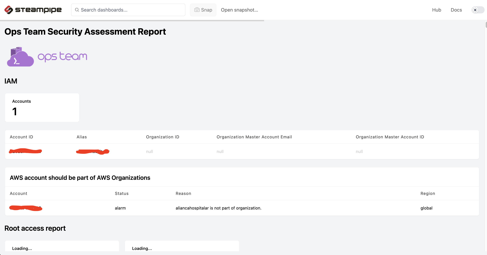

# Ops Team Steampipe Report

Esse projeto tem como objetivo criar um dashboard customizado utilizando o steampipe, resumindo os principais pontos de melhoria nas contas AWS dos clientes.

Através do steampipe é possível criar queries sql para listar os recursos.

```
select
  title,
  create_date,
  mfa_enabled
from
  aws_iam_user
```
```
+-----------------+---------------------+-------------+
| title           | create_date         | mfa_enabled |
+-----------------+---------------------+-------------+
| pam_beesly      | 2005-03-24 21:30:00 | false       |
| creed_bratton   | 2005-03-24 21:30:00 | true        |
| stanley_hudson  | 2005-03-24 21:30:00 | false       |
| michael_scott   | 2005-03-24 21:30:00 | false       |
| dwight_schrute  | 2005-03-24 21:30:00 | true        |
+-----------------+---------------------+-------------+
```




### Install in MAC
```
brew install turbot/tap/steampipe

update

brew upgrade turbot/tap/steampipe

steampipe -v
```

### Install in Linux
```
sudo /bin/sh -c "$(curl -fsSL https://steampipe.io/install/steampipe.sh)"

steampipe -v

install plugin
steampipe plugin install steampipe
```

### Install AWS plugin

```
steampipe plugin install aws
```

### Executar o dashboard
```
git clone git@github.com:opsteamhub/opsteam-steampipe-report.git

steampipe dashboard

http://localhost:9194
```

### Estrutura dos diretórios

#### queries
O diretório queries contem todas as queries executadas no dashboard. Os arquivos de queries estão separados por recursos da AWS.

#### dashboards
Dentro do arquivo report.sp, contém as definições dos dashboards.

#### Configuração de conta AWS

O steampipe utiliza a autenticação do AWS CLI.

No arquivo aws.spc, é possível definir os profiles de contas AWS configurados para o AWS CLI, para poder ser visualizados no steampipe.

##### Exemplo de configuração
```
vi ~/.steampipe/config/aws.spc


connection "aws_profile" {
  plugin = "aws"
  regions = ["*"]
  profile = "profile_name" 
}

connection "aws_all" {
  plugin      = "aws" 
  type        = "aggregator"
  connections = ["*"]
}

```

Para mais informações, só seguir a documentação sobre configuração de contas.

https://steampipe.io/docs/guides/aws-orgs